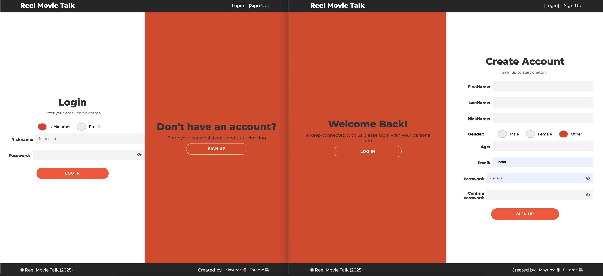
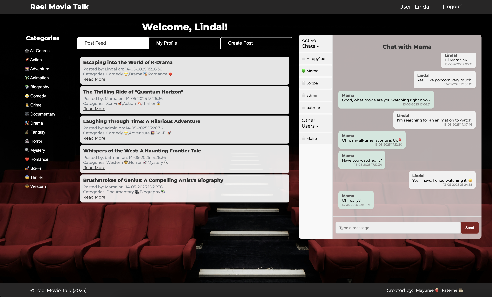

# RealTalk Forum 🍿

**A modern, real-time forum with private messaging powered by WebSockets**  
*Last Updated: May 21, 2025*

---

## 🚀 Features

### 🔐 Registration & Login
- **Secure Auth**: Register with nickname, email, password, and profile details (age, gender, etc.)
- **Flexible Login**: Use **nickname** *or* **email** + password
- Session management with cookies
- Bcrypt password hashing

### 📝 Posts & Comments
- Create posts with categories 
- Comment on posts
- Feed-style post display
- Comments visible on click (reduces clutter)

### 💬 Private Messaging
- **Real-time chat** via WebSockets
- **Smart notifications**:
  - 🍿 Unread badge counters on chat list items
  - ⏲️ "User is typing.🍿.🍿.🍿" animation indicators
- Online user list sorted by:
  - Last message time (recent first)
  - Alphabetical order for new chats
- Message history with infinite scroll (10 messages per load)
- Message formatting:
```
Admin 
"Want to watch a movie later?"
14-05-2025 14:30:00
```

---

## 🛠 Tech Stack

| Component       | Technology                          |
|-----------------|-------------------------------------|
| **Database**    | SQLite                              |
| **Backend**     | Golang (HTTP server, WebSockets)    |
| **Frontend**    | Vanilla JavaScript + CSS3, HTML5          |
| **Auth**        | UUID sessions + bcrypt              |

**Key Packages**:  
`gorilla/websocket` `sqlite3` `uuid` `bcrypt`

---

## ⚙️ Installation

1. Clone repo
git clone https://01.gritlab.ax/git/mreunsat/real-time-forum

2. Install dependencies
```
go mod init real-time-forum
go mod tidy
````

3. Initialize database & start server
```
go run .
```
4. Start server

Visit `http://localhost:8999` in your browser!

---

## 🧠 Learning Outcomes

This project teaches:
- **Web Fundamentals**: HTTP, cookies, DOM manipulation
- **Real-Time Systems**: WebSocket implementation
- **Concurrency**: Go routines/channels for message brokering
- **SQL**: Complex queries for message pagination
- **Performance**: Throttling/debouncing scroll events

---

*Created by Mayuree 🍿 and Fateme 🎞️ * 
- Mayuree Reunsati : https://github.com/mareerray
- Fatemeh Kheirkhah : https://github.com/fatemekh78




