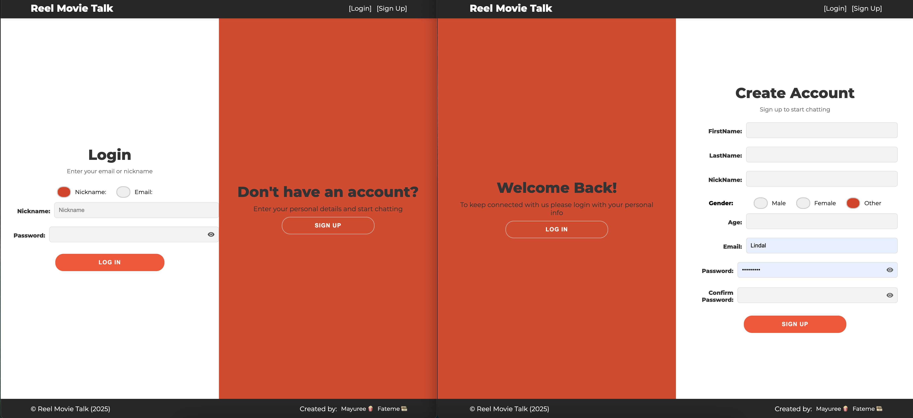
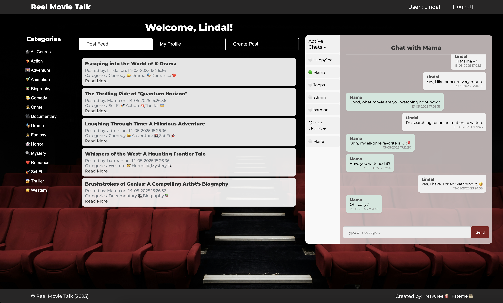

# ReelTalk Forum 🍿

**A modern real-time forum with private messaging powered by WebSockets, using Supabase as the database and deployed on Render.**  
*Last Updated: May 21, 2025*

---

## 🚀 Features

### 🔐 Registration & Login
- **Secure Auth**: Register with nickname, email, password, and profile details (age, gender, etc.)
- **Flexible Login**: Use **nickname** *or* **email** + password
- Session management with cookies
- Bcrypt password hashing

### 📝 Posts & Comments
- Create posts with categories 
- Comment on posts
- Feed-style post display
- Comments visible on click (reduces clutter)

### 💬 Private Messaging
- **Real-time chat** via WebSockets
- **Smart notifications**:
  - 🍿 Unread badge counters on chat list items
  - ⏲️ "User is typing.🍿.🍿.🍿" animation indicators
- Online user list sorted by:
  - Last message time (recent first)
  - Alphabetical order for new chats
- Message history with infinite scroll (10 messages per load)
- Message formatting:
```
Admin 
"Want to watch a movie later?"
14-05-2025 14:30:00
```

---

## 🛠 Tech Stack

| Component    | Technology |
| --- | --- |
| Database     | Supabase PostgreSQL |
| Backend      | Go, HTTP server, WebSockets |
| Frontend     | HTML5, CSS3, Vanilla JavaScript |
| Auth         | UUID sessions, bcrypt |
| Deployment   | Render |


---

## Installation

1. Clone the repository:
```bash
git clone https://01.gritlab.ax/git/mreunsat/real-time-forum
```

2. Install dependencies:
```bash
go mod tidy
```

3. Set up your environment variables for Supabase and any other required secrets.

4. Run the app locally:
```bash
go run .
```

5. Open your browser and visit:
```text
http://localhost:8999
```

---

## Deployment

This project is deployed on Render. The database is powered by Supabase PostgreSQL, and the required connection values are configured through environment variables on Render.

---

## 🧠 Learning Outcomes

This project helped me learn:
- **Web Fundamentals**: HTTP, cookies, and DOM manipulation.
- **Real-Time Systems**: WebSocket-based communication.
- **Concurrency**: Go routines and channels for message handling.
- **Databases**: PostgreSQL queries, data modeling, and pagination.
- **Deployment**: Hosting an app on Render and managing environment variables.
- **Performance**: Throttling and debouncing scroll events.

---

*Created by Mayuree 🍿 and Fateme 🎞️ * 
- Mayuree Reunsati : https://github.com/mareerray
- Fatemeh Kheirkhah : https://github.com/fatemekh78




